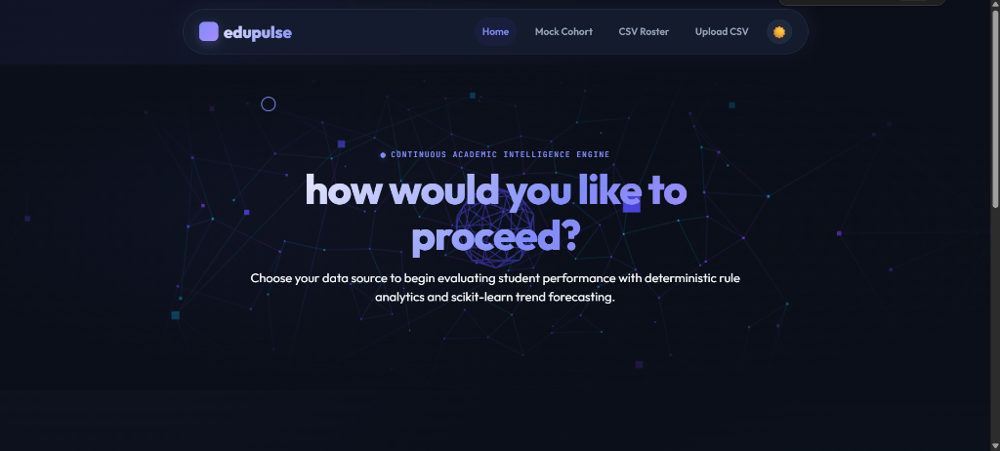
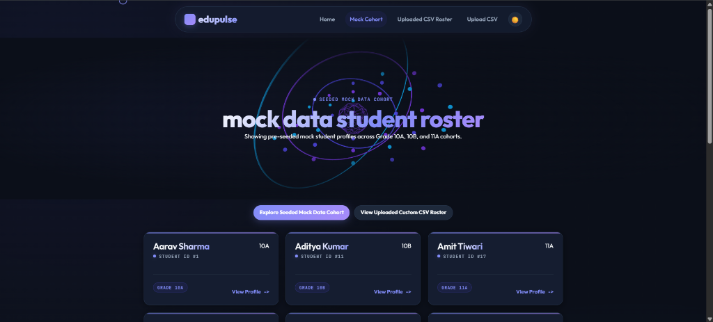
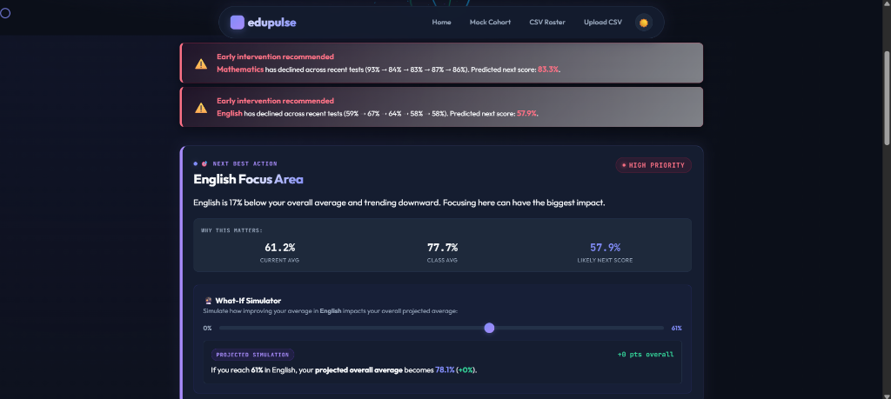
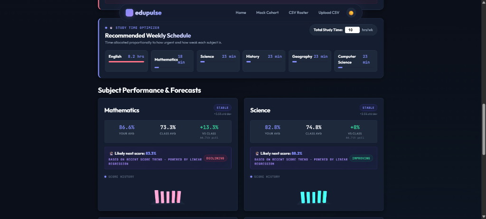
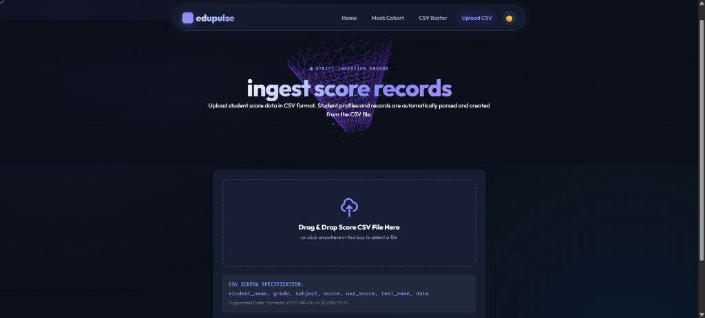

<div align="center">

<br />


[](https://git.io/typing-svg)


*A continuous read on a student's academic health — turning raw test scores into actionable learning insights with Next Best Action recommendations, What-If simulation, and interactive 3D WebGL visualizations.*

</div>


## 🎯 About EduPulse 2.0

**EduPulse 2.0** is an academic diagnostic and recommendation platform built to replace static one-time report cards with a continuous, data-driven read on student performance. Instead of relying on opaque LLM APIs or expensive cloud services, EduPulse uses a **deterministic rules engine** paired with **explainable machine learning (`scikit-learn`)**, **interactive Three.js 3D data visualizations**, and **GSAP motion systems**.

> [!NOTE]
> **Zero API Keys Required & 100% Self-Hosted Assets:** EduPulse runs completely offline without third-party CDN dependencies. All 3D rendering engines (Three.js), motion libraries (GSAP), and ML models run locally or in self-contained deployment environments.

<div align="center">
  
  <br />
  *<sub>EduPulse 2.0 Home Screen — Interactive Three.js WebGL constellation hero with mouse-parallax and dark mode toggle</sub>*
  <br /><br />
  
  <br />
  *<sub>Student Roster Screen — Explore pre-seeded mock student profiles across Grade 10A, 10B, and 11A cohorts</sub>*
</div>


## 🌐 Live Deployment Links

- ⚡ **Backend REST API (Render)**: [https://edupulse-1o5s.onrender.com](https://edupulse-1o5s.onrender.com)
- 📊 **Interactive OpenAPI Docs**: [https://edupulse-1o5s.onrender.com/docs](https://edupulse-1o5s.onrender.com/docs)


## 🔄 How It Works

EduPulse delivers a seamless diagnostic workflow from data ingestion to actionable recommendations:

1. 🚀 **Data Source Choice** — Explore pre-seeded cohorts across Grade 10A, 10B, and 11A, or upload custom test score CSV files.
2. 📊 **Rule Analytics & Priority Scoring** — Computes weakness gap (`weakness_score`) and negative trend slope (`decline_score`) to produce a weighted priority rating (`weakness * 0.6 + decline * 0.4`).
3. 🤖 **Scikit-Learn ML Processing** — Fits `LinearRegression` per subject for next-score forecasting and trajectory slope, while `KMeans` clusters students into distinct learning profiles.
4. 🔮 **What-If Simulation** — Simulates how improving a specific subject score impacts overall average, weak-topic flags, and class percentile.
5. 💡 **3D Visualizations & Motion** — Inspect interactive 3D WebGL bar charts with trend-colored emissive glow, magnetic buttons, custom cursor, and smooth GSAP reveals.

<div align="center">
  
  <br />
  *<sub>Diagnostic Profile — Early intervention warning banners, Next Best Action recommendation card, and cluster profile tag</sub>*
</div>


## ✨ Core Capability Layer

### 🎯 1. Priority Engine & Next Best Action
- **Weighted Priority Formula**: Combines present weakness gap with linear regression decline magnitude:
  $$\text{Combined Priority} = (\text{Weakness Score} \times 0.6) + (\text{Decline Score} \times 0.4)$$
- **Next Best Action Card**: Highlights the single highest-urgency subject with plain-language explanations, current vs overall averages, target recommendations, and potential percentile gains.
- **Early Intervention Banner**: Displays early warning alerts for subjects exhibiting continuous declining score trajectories.

### 🔮 2. What-If Simulator & Study Time Optimizer
- **Real-Time Interactive Slider**: Drag the target score slider (0% to 100%) to dynamically project simulated overall average, percentile shift, and weak topic status.
- **Study Time Optimizer**: Allocates weekly study hours (e.g. 10 hrs/wk) proportionally across subjects based on combined urgency ratings.

### 🎨 3. 3D WebGL & GSAP Motion System
- **Three.js WebGL Hero Constellation**: An abstract "academic pulse" 3D node network with emissive brand colors and smooth camera mouse-parallax.
- **Three.js 3D Subject Bar Charts**: Interactive 3D score bar charts per subject with trend-colored emissive glow (Rose for Declining, Emerald for Improving, Indigo for Stable), hover raycaster tooltips, and off-screen render loop optimization.
- **GSAP + ScrollTrigger Reveals**: Staggered scroll reveals, magnetic primary CTAs, custom desktop cursor follower, and smooth page transition overlays.
- **Dark / Light Theme Toggle**: Sun/Moon toggle with persistent CSS token themes (`[data-theme="dark"]`).

<div align="center">
  
  <br />
  *<sub>Subject Analytics & Study Optimizer — Recommended weekly study schedule and interactive Three.js 3D score bar charts</sub>*
</div>

<div align="center">
  
  <br />
  *<sub>CSV Score Ingestion Screen — Strict per-row parser with drag-and-drop zone and instant database ingestion feedback</sub>*
</div>


## 🛠️ Tech Stack

| Component | Technology | Role |
|---|---|---|
| **Backend API** |  | High-performance async REST API & data contracts |
| **Machine Learning** |  | `LinearRegression` trajectory forecasting & `KMeans` clustering |
| **3D Rendering** |  | WebGL 3D constellation hero & interactive 3D bar charts |
| **Animations** |  | Staggered ScrollTrigger reveals, magnetic CTAs, page transitions |
| **Database & ORM** |   | Relational score persistence with unique deduplication constraints |
| **Frontend** |    | Glassmorphism UI tokens, theme switcher, and ES modules |


## 📁 Sample CSV Score Dataset

EduPulse comes pre-packaged with a clean test score dataset located in the project's data folders:

- **Primary Repository Location**: [`data/sample_scores.csv`](data/sample_scores.csv)
- **Frontend Accessible Location**: [`frontend/data/sample_scores.csv`](frontend/data/sample_scores.csv) (allows direct download or testing from web pages)
- **Direct Download**: [📥 Download sample_scores.csv](data/sample_scores.csv)
- **Format Schema**: `student_name`, `subject`, `score`, `max_score`, `test_name`, `date`


## 🚀 Quick Start (Local Setup)

If you have downloaded the project zip file or cloned the repository, run the backend and frontend with these commands:

### 1. Backend Server (FastAPI)
```bash
# Navigate to backend directory
cd backend

# Install dependencies
pip install -r requirements.txt

# Launch FastAPI backend on port 8000
python -m uvicorn app.main:app --reload --port 8000
```
*Backend API will be live at `http://localhost:8000` (Swagger docs at `http://localhost:8000/docs`).*

### 2. Frontend Web App (Python HTTP Server or Live Server)
```bash
# Navigate to frontend directory
cd frontend

# Serve frontend static assets on port 3000
python -m http.server 3000
```
*Open `http://localhost:3000` in your web browser to explore EduPulse.*


<div align="center">

Made with ❤️ for students, teachers, and data-driven learning.


</div>
# Edu-Pulse

